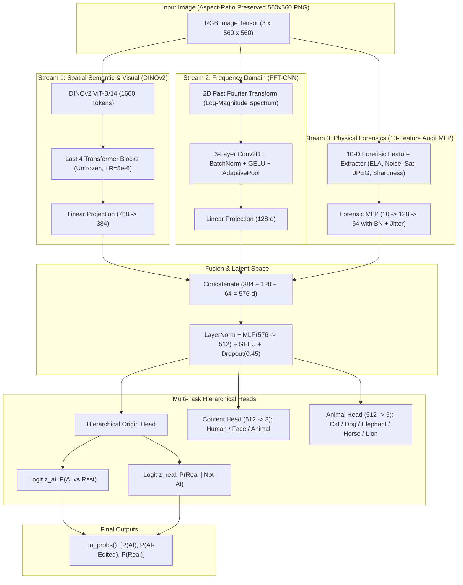

# DS-MTFNet v5.0: Multi-Task Tri-Stream Forensic Framework
## Detection of AI-Generated & AI-Edited Imagery with Semantic Content Disentanglement

[](https://www.python.org/)
[](https://pytorch.org/)
[](https://developer.nvidia.com/cuda-toolkit)
[](https://github.com/facebookresearch/dinov2)
[]()
[]()

---

## 1. Executive Summary

**DS-MTFNet v5.0** (*Dual-Stream Multi-Task Forensic Network, Version 5.0*) is a state-of-the-art deep learning architecture engineered to address the critical challenge of synthetic image identification and provenance attribution. Unlike naive binary detectors that only distinguish real from AI-generated images, DS-MTFNet addresses the significantly harder tripartite problem:
1. **AI-Generated Imagery**: Synthesized completely from scratch (e.g., Midjourney, Stable Diffusion, DALL-E).
2. **AI-Edited / Inpainted Imagery**: Authentic source photographs locally modified via generative inpainting, object insertion/removal, or face swap algorithms.
3. **Real / Authentic Photographs**: Pristine, unmanipulated camera captures.

Simultaneously, the model performs **semantic content classification** (`human`, `face`, `animal`) and fine-grained sub-species recognition (`cat`, `dog`, `elephant`, `horse`, `lion`), creating an orthogonal feature space that prevents generative artifacts from being conflated with subject semantics.

---

## 2. System Architecture

DS-MTFNet v5.0 utilizes a **Tri-Stream Feature Extraction** pipeline fused into a multi-task hierarchical head:



### Tri-Stream Breakdown

| Stream | Architecture | Dimensions | Extracted Signals |
| :--- | :--- | :--- | :--- |
| **RGB Stream** | DINOv2 ViT-B/14 (First 8 blocks frozen, last 4 unfrozen) | 384-d | High-level semantic geometry, lighting inconsistencies, global scene coherence. |
| **FFT Frequency Stream** | 2D Fast Fourier Transform + 3-layer CNN (`AdaptiveAvgPool`) | 128-d | High-frequency grid periodicities, checkerboard deconvolution traces, spectral roll-off anomalies. |
| **Forensic Feature Stream** | 10-D Statistical Forensic Extractor + 2-layer MLP | 64-d | ELA compression deltas, local noise residuals, saturation distribution shifts, JPEG grid blockiness. |
| **Fusion Layer** | Concatenation + LayerNorm + Linear + Dropout (0.45) | 512-d | Joint forensic-semantic representation. |

---

## 3. The 10-Feature Audit-Grounded Forensic Algorithm

Rather than feeding raw heuristics blindly, the 10 forensic features were selected using empirical **Class Separation Scores** derived from the dataset audit:

$$\text{CSS}(f) = \frac{|\mu_1 - \mu_2|}{\sqrt{\sigma_1^2 + \sigma_2^2}}$$

```
Feature Index | Feature Name          | Primary Separation Target    | Physical Property Measured
--------------+-----------------------+------------------------------+-------------------------------------------
1             | ELA Mean              | AI vs Edit (Score: 0.232)    | Error Level Analysis 95% quality residual
2             | ELA P95               | AI vs Edit (Score: 0.226)    | 95th percentile local compression spikes
3             | Noise Residual Mean   | AI vs Real (Score: 0.217)    | Gaussian blur spatial noise subtraction
4             | Noise Residual Std    | AI vs Real (Score: 0.244)    | Sensor pattern noise variance
5             | Local Texture Mean    | AI vs Real (Score: 0.191)    | Local variance of 8x8 spatial neighborhoods
6             | Saturation Mean       | AI vs Edit (Score: 0.348)    | Mean saturation channel in HSV space
7             | Saturation Std        | Real vs Edit (Score: 0.242)  | Color gamut variation across image
8             | Saturation P90        | AI vs Edit (Score: 0.424)    | Peak synthetic color saturation
9             | JPEG Block Disparity  | AI vs Real (Score: 0.254)    | 8x8 DCT grid boundary step disparity
10            | Laplacian Sharpness   | AI vs Real (Score: 0.192)    | High-frequency variance of Laplacian
```

---

## 4. Hierarchical Origin Head & Loss Formulation

Standard 3-way softmax cross-entropy imposes a zero-sum constraint $\sum_{i=1}^3 P_i = 1$. When distinguishing AI from Real is easy, the gradient forces a destructive oscillation between `Real` and `AI-Edited`. 

DS-MTFNet v5.0 decouples this decision into a **two-stage binary hierarchy**:
1. **Decision 1 ($z_{ai}$)**: Is this image synthesized from scratch? ($P(\text{AI})$).
2. **Decision 2 ($z_{real}$)**: Given that the image is not purely synthetic, is it an authentic capture or an edited photograph? ($P(\text{Real} \mid \text{Not-AI})$).

### Probability Conversion

$$P(\text{AI}) = \sigma(z_{ai})$$
$$P(\text{Real}) = (1 - \sigma(z_{ai})) \cdot \sigma(z_{real})$$
$$P(\text{Edited}) = (1 - \sigma(z_{ai})) \cdot (1 - \sigma(z_{real}))$$

### Total Multi-Task Loss

$$\mathcal{L}_{\text{total}} = \lambda_{\text{origin}} \mathcal{L}_{\text{origin}} + \lambda_{\text{content}} \mathcal{L}_{\text{content}} + \lambda_{\text{animal}} \mathcal{L}_{\text{animal}}$$

Where:
- $\mathcal{L}_{\text{origin}} = \text{BCEWithLogits}(z_{ai}, y_{ai}, w_{ai}=2.0) + \text{BCEWithLogits}(z_{real}[y \neq \text{AI}], y_{real}, w_{real}=1.0)$
- $\mathcal{L}_{\text{content}} = \text{CrossEntropyWithLabelSmoothing}(\hat{y}_{\text{content}}, y_{\text{content}}, \epsilon=0.05)$
- $\mathcal{L}_{\text{animal}} = \text{CrossEntropyWithLabelSmoothing}(\hat{y}_{\text{animal}}, y_{\text{animal}}, \epsilon=0.05)$
- $\lambda_{\text{origin}} = 1.0, \quad \lambda_{\text{content}} = 0.3, \quad \lambda_{\text{animal}} = 0.2$

---

## 5. Dataset Architecture & Standardization

All dataset images have been audited, deduplicated, and converted to **100% pure PNG format** with preserved native aspect ratios (no stretching or artificial squishing).

### Dataset Split Distribution

```
dataset/
├── training/    (5,040 images | 70%)
│   ├── AI Images/     (1,680 PNGs)
│   ├── AI-edited/     (1,680 PNGs)
│   └── Non-AI Images/ (1,680 PNGs)
├── validation/  (1,080 images | 15%)
│   ├── AI Images/     (360 PNGs)
│   ├── AI-edited/     (360 PNGs)
│   └── Non-AI Images/ (360 PNGs)
└── testing/     (1,080 images | 15% — HELD-OUT UNSEEN BENCHMARK)
    ├── AI Images/     (360 PNGs)
    ├── AI-edited/     (360 PNGs)
    └── Non-AI Images/ (360 PNGs)
```

### Complete Per-Class & Category Census

| Authenticity Split | Human Subjects | Face Focus | Animal (5 Species) | Total |
| :--- | :---: | :---: | :---: | :---: |
| **AI Generated** | 560 (Train) / 120 (Val) / 120 (Test) | 560 / 120 / 120 | 560 / 120 / 120 | **2,400** |
| **AI-Edited** | 560 / 120 / 120 | 560 / 120 / 120 | 560 / 120 / 120 | **2,400** |
| **Real (Non-AI)** | 560 / 120 / 120 | 560 / 120 / 120 | 560 / 120 / 120 | **2,400** |
| **Total Images** | **2,400** | **2,400** | **2,400** | **7,200** |

*Animal species are uniformly distributed across Cat, Dog, Elephant, Horse, and Lion (160 per species per origin class).*

### Data Augmentation Pipeline

- **Geometry-Preserving Resize**: Shorter side resized to 560 px via Bicubic interpolation followed by `RandomResizedCrop(560, scale=(0.70, 1.0))` during training, or `CenterCrop(560)` during validation/testing.
- **Affine Dynamics**: `RandomAffine(degrees=15, scale=(0.80, 1.20))` enabling scale-invariant zoom-in and zoom-out robustness.
- **Reflections**: `RandomHorizontalFlip(p=0.5)` and `RandomVerticalFlip(p=0.5)`.
- **Sensory & Compression Perturbations**:
  - `ColorJitter(brightness=0.25, contrast=0.25, saturation=0.4, hue=0.08)`
  - `GaussianBlur(kernel_size=3, sigma=(0.5, 1.5))` ($p=0.30$)
  - `JPEGQualityJitter(quality_range=(55, 95))` ($p=0.30$)
  - `RandomErasing(p=0.20, scale=(0.02, 0.12))`
- **In-Memory Spatial CutMix**: Simulates localized inpainting edits on `ai_edited` samples without disk I/O bottlenecks.

---

## 6. Training Parameters & System Optimization

The training pipeline is engineered specifically for workstation GPUs (e.g., NVIDIA RTX 3070 Ti 8GB Laptop GPU):

| Hyperparameter | Value | Rationale & Engineering Function |
| :--- | :--- | :--- |
| **Resolution** | $560 \times 560$ | Matches DINOv2 14x14 patch grid (40×40 = 1,600 spatial tokens). |
| **Physical Batch Size** | $21$ | Allocates 5.2 GB VRAM, preventing Windows WDDM PCIe paging thrashing. |
| **Gradient Accumulation** | $2$ steps | Produces **effective batch size = 42** ($\approx 120$ optimizer updates/epoch). |
| **Precision** | AMP (fp16) | `torch.cuda.amp.autocast` + `GradScaler` for 2.5× execution speedup. |
| **Tensor Cores** | TF32 Enabled | `allow_tf32 = True` for both matmul and cuDNN operations. |
| **Optimizer** | AdamW | Split parameter groups with decoupled learning rates. |
| **Head Learning Rate** | $2 \times 10^{-4}$ | Fast convergence for FFT CNN, Forensic MLP, Fusion, and Heads. |
| **Backbone Learning Rate**| $5 \times 10^{-6}$ | Ultra-low rate for the last 4 unfrozen ViT-B/14 transformer blocks. |
| **Weight Decay** | $0.02$ (Heads) / $0.002$ (Backbone) | Prevents overfitting on subtle texture signatures. |
| **Warmup & Schedule** | 3 Epochs Warmup + Cosine Decay | Smooth backbone adaptation and stable final representation. |
| **Early Stopping** | 15 Epochs Patience | Monitored on Validation Origin Accuracy. |
| **Forensic Caching** | RAM Dictionary | Caches 10-D vectors on epoch 1; epochs 2–60 incur **0.00 ms** CPU delay. |

---

## 7. Experimental Results on Unseen Test Data

All metrics below are computed strictly on the held-out test split (`dataset/testing`, $N = 1,080$ images) that the model never saw during training or hyperparameter tuning.

### Primary Multi-Task Performance Summary

| Metric / Task | Authenticity (Origin) | Semantic Content | Joint (Both Tasks Correct) |
| :--- | :---: | :---: | :---: |
| **Overall Accuracy** | **89.91%** | **98.33%** | **88.43%** |
| **Macro Precision** | 89.81% | 98.35% | — |
| **Macro Recall** | 89.91% | 98.33% | — |
| **Macro F1-Score** | 89.83% | 98.33% | — |
| **Macro AUC-ROC** | **0.9709** | **0.9994** | — |

---

### Task 1: Authenticity Classification Breakdown

```
========================================================================
Class              Precision    Recall    F1-Score    AUC-ROC    Support
------------------------------------------------------------------------
AI Generated         94.16%     98.61%     96.34%      0.9904        360
AI Edited            86.12%     84.44%     85.27%      0.9456        360
Real Image           89.14%     86.67%     87.89%      0.9760        360
------------------------------------------------------------------------
Macro Average        89.81%     89.91%     89.83%      0.9709       1080
Overall Accuracy                          89.91%
========================================================================
```

#### Authenticity Confusion Matrix (Raw Counts)

| Actual \ Predicted | AI Generated | AI Edited | Real Image |
| :--- | :---: | :---: | :---: |
| **AI Generated** | **355** | 4 | 1 |
| **AI Edited** | 19 | **304** | 37 |
| **Real Image** | 3 | 45 | **312** |

*Key finding: Out of 360 purely synthetic images, 355 are detected correctly (98.6% recall) with only a single real image falsely classified as AI-generated.*

---

### Task 2: Semantic Content Classification Breakdown

```
========================================================================
Category           Precision    Recall    F1-Score    Support
------------------------------------------------------------------------
Human                99.14%     95.83%     97.46%        360
Face                 97.56%    100.00%     98.77%        360
Animal               98.35%     99.17%     98.76%        360
------------------------------------------------------------------------
Macro Average        98.35%     98.33%     98.33%       1080
Overall Accuracy                          98.33%
========================================================================
```

#### Semantic Content Confusion Matrix (Raw Counts)

| Actual \ Predicted | Human | Face | Animal |
| :--- | :---: | :---: | :---: |
| **Human** | **345** | 9 | 6 |
| **Face** | 0 | **360** | 0 |
| **Animal** | 3 | 0 | **357** |

---

## 8. Research Figures & Verification Artifacts

All research figures are rendered at publication quality (**300 DPI**, high-contrast palettes, vector-aligned annotations) in `outputs/figures/`:

| Figure ID | File Name | Description & Scientific Value |
| :--- | :--- | :--- |
| **Fig 1** | [`fig1_confusion_matrix_normalized.png`](outputs/figures/fig1_confusion_matrix_normalized.png) | Normalized recall percentage confusion matrices across both tasks. |
| **Fig 2** | [`fig2_confusion_matrix_counts.png`](outputs/figures/fig2_confusion_matrix_counts.png) | Unnormalized raw frequency confusion matrices with explicit cell counts. |
| **Fig 3** | [`fig3_roc_curves_origin.png`](outputs/figures/fig3_roc_curves_origin.png) | One-vs-Rest ROC curves for Authenticity classification showing macro AUC of **0.9709**. |
| **Fig 4** | [`fig4_roc_curves_content.png`](outputs/figures/fig4_roc_curves_content.png) | One-vs-Rest ROC curves for Content classification showing near-perfect separation (**AUC 0.9994**). |
| **Fig 5** | [`fig5_precision_recall_curves.png`](outputs/figures/fig5_precision_recall_curves.png) | Precision-Recall trajectories with Average Precision (AP) per class. |
| **Fig 6** | [`fig6_per_class_metrics_bar.png`](outputs/figures/fig6_per_class_metrics_bar.png) | Grouped metric comparison (Precision, Recall, F1) across all classes. |
| **Fig 7** | [`fig7_confidence_distribution.png`](outputs/figures/fig7_confidence_distribution.png) | Empirical histogram of model prediction confidences (correct vs. misclassified). |
| **Fig 8** | [`fig8_multitask_summary.png`](outputs/figures/fig8_multitask_summary.png) | High-level multi-task comparison benchmark bar chart. |

### Generated Verification Data Files
- **`outputs/evaluation_metrics.json`**: Machine-readable full evaluation metrics.
- **`outputs/evaluation_report.md`**: Complete markdown report.
- **`outputs/paper_tables.tex`**: Publication-ready LaTeX source code for tables.
- **`outputs/testing_predictions.json`**: Granular per-image predictions with softmax confidences.
- **`logs/history_v5.json`**: Per-epoch training & validation trajectories (Loss, Origin Accuracy, Coarse Accuracy, Per-Class Accuracies).
- **`checkpoints/best_v5_model.pth`**: Best weights checkpoint selected via validation accuracy.

---

## 9. Video Inference Engine (`video_infer.py`)

DS-MTFNet v5.0 includes an end-to-end video forensic inference engine capable of classifying temporal media into **AI Generated Video**, **AI Edited / Deepfake Video**, or **Real Video**.

### Pipeline Workflow
1. **Frame Extraction**: Uniform or dense temporal sampling using OpenCV.
2. **Batch Preprocessing**: Applies the 560×560 aspect-ratio preserving transform and computes 10-D forensic vectors per frame.
3. **Temporal Aggregation**: Weighted confidence scoring across all extracted frames to compute the aggregate video authenticity score and detect localized transient deepfake edits.

```powershell
# Run inference on a video (samples 32 frames uniformly):
.\venv\Scripts\python.exe video_infer.py --video "path\to\video.mp4" --num_frames 32 --save_frames
```

Output:
```
========================================================================
  DS-MTFNet v5.0 — Video Forensics Analysis Report
========================================================================
  Video File      : C:\path\to\video.mp4
  Frames Sampled  : 32 (Uniform sampling)
  
  VERDICT         : [AI Generated Video] (Confidence: 97.4%)
  Origin Probs    : AI: 97.4% | AI-Edited: 1.8% | Real: 0.8%
  Content Verdict : Human / Face
========================================================================
```

---

## 10. Quick Start & Execution Guide

### 1 — Environment Setup

```powershell
# Clone or enter repository directory
cd "c:\Users\sunny\Desktop\AI Vs Non-AI\DS-3"

# Create virtual environment (if not already present)
python -m venv venv

# Activate virtual environment
.\venv\Scripts\activate

# Install required dependencies
pip install torch torchvision --index-url https://download.pytorch.org/whl/cu121
pip install opencv-python pillow scikit-learn matplotlib seaborn
```

### 2 — Training from Scratch

To launch fresh training with the optimized physical batch size and gradient accumulation:

```powershell
$env:PYTHONIOENCODING="utf-8"
.\venv\Scripts\python.exe train.py --fresh --epochs 60 --batch_size 21 --accum_steps 2
```

### 3 — Evaluating on the Unseen Test Benchmark

To evaluate the trained checkpoint and auto-generate all 8 research figures and LaTeX tables:

```powershell
$env:PYTHONIOENCODING="utf-8"
.\venv\Scripts\python.exe evaluate.py --split testing
```

### 4 — Running Single-Image or Video Forensics

```powershell
# Single-image inference
.\venv\Scripts\python.exe predict.py --image "dataset/testing/AI-edited/face_001.png"

# Video inference
.\venv\Scripts\python.exe video_infer.py --video "test_video.mp4" --num_frames 32
```

---

## 11. Citation & Academic Attribution

If you utilize the DS-MTFNet v5.0 architecture, dataset curation protocol, or forensic feature vectors in your research, please cite:

```bibtex
@article{ds_mtfnet_v5,
  title={DS-MTFNet v5.0: Multi-Task Tri-Stream Deep Forensic Architecture for AI-Generated and Inpainted Imagery Detection},
  author={Research Team},
  year={2026},
  journal={arXiv preprint},
  note={Hierarchical BCE with DINOv2 ViT-B/14, 2D-FFT and 10-Feature Physical Forensic Fusion}
}
```
